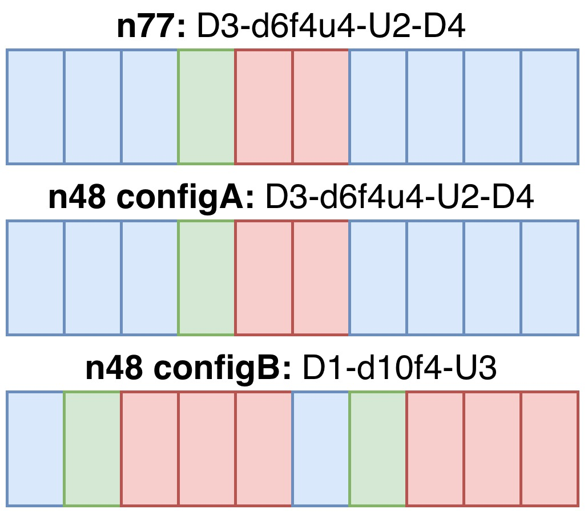

# Experiment information

## What the controls mean

**Location** is the phone measurement point. The two distances below are approximate distances from the n48 CBSD and the live n77 site.

- CBSD — 30 m — Location A — 1000 m — n77 site
- CBSD — 120 m — Location B — 940 m — n77 site
- CBSD — 330 m — Location C — 700 m — n77 site

**Set** identifies the measurement round. Set A is the original PHY campaign. Set B is the later campaign and contains the spectrum-analyzer recordings. Set B has no Location A measurements.

**n48 TDD Config** selects the CBSD slot pattern. Config A follows the same broad DL/UL timing as the live n77 carrier. Config B uses a different slot pattern, creating more opportunities for opposite-direction operation at the 3700 MHz band edge.

## Measurement setup

The experiment compares a live n48 CBSD at 3660–3700 MHz with Verizon n77 at 3700–3800 MHz. Both use 30 kHz subcarrier spacing. QualiPoc phones recorded PHY measurements; `C_` collections belong to n48 and `V_` collections belong to n77. Verizon data is restricted to the MCG PCell, which is consistently NR-ARFCN 647328.

Each operation label is written as **n48 : n77**. For example, **UL : DL** means n48 transmitted uplink while n77 transmitted downlink. In the four active-active cases, the two phones measured at the same time.

## Spectrum-analyzer setup

The analyzer swept 3650–3810 MHz using 1 MHz RBW, 1 MHz VBW, 400 kHz frequency spacing, and a positive-peak detector. The files contain about 60 seconds of data. The 400 kHz points oversample the 1 MHz filter, so neighboring points overlap and are correlated.

This is not a simultaneous 160 MHz capture. A sweep observes different frequencies at slightly different times. The plots are valid for long-term spectrum level, occupancy, and band-edge comparisons, but not for claiming that short events at distant frequencies happened simultaneously.

## Spectrum (Freq)

At each frequency, every dBm sample is converted to mW. The mean is calculated in mW and converted back to dBm. The median and percentile limits describe the distribution at that frequency. The transparent envelope shows the selected percentile range across frequency.

The default curve is the linear-power mean. Median is available when a result less sensitive to brief peaks is preferred.

## Spectrum (Power)

Each sweep produces one estimated power value for the selected band: n48 from 3660–3700 MHz or n77 from 3700–3800 MHz. Bucket powers are converted from dBm to mW, normalized by the nominal 1 MHz RBW, integrated across frequency with the trapezoidal rule, and converted back to dBm:

`P_band [mW] ≈ integral(10^(P_dBm(f)/10) / RBW) df`

The CDF uses all per-sweep band-power estimates. Mean or median controls only the summary marker. The selected percentile interval is the shaded vertical region. Because the source uses a swept positive-peak detector and overlapping RBW buckets, this is an estimated sweep-integrated power, not a simultaneous channel-power measurement.
